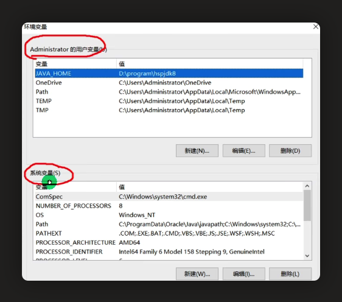

# 在线练习
https://c.runoob.com/compile/10/

# JDK安装
```
java8 下载地址
https://www.oracle.com/java/technologies/downloads/#java8
https://www.oracle.com/hk/java/technologies/javase/javase8u211-later-archive-downloads.html

安装目录
mac：/Library/Java/JavaVirtualMachines/jdk1.8.0_351.jdk
windows：C:\Program Files\Java\jdk1.8.0_202\

Windows配置环境变量：
    在path中新增 JAVA_HOME= /Library/Java/JavaVirtualMachines/jdk1.8.0_201.jdk 指向jdk安装的主目录
    新增 PATH：%JAVA_HOME%\bin
    PATH配置在上面仅对当前用户生效，配置在下面对所有人都生效
```



